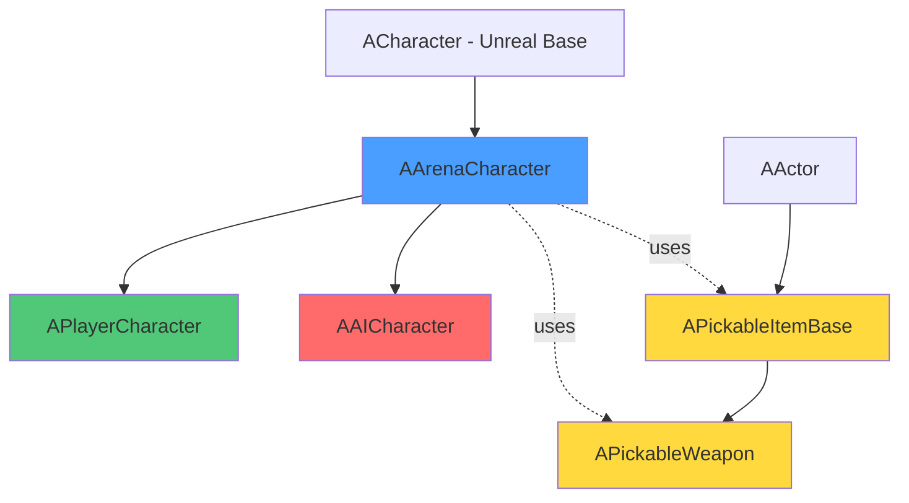
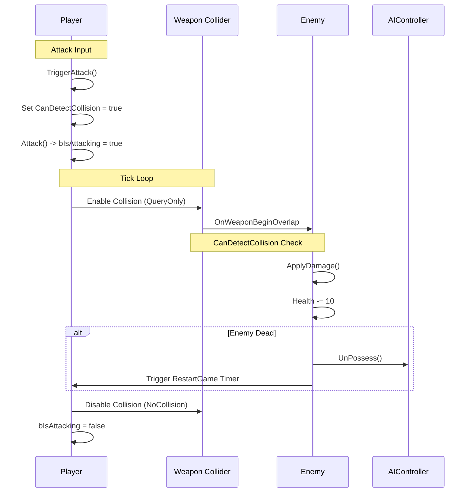

# Gladiator Arena

A third-person arena combat game built in Unreal Engine featuring player vs AI combat with hammer and shield mechanics.
---

## Core Architecture

The project uses a **component-based inheritance hierarchy** combined with **composition patterns** to create a flexible combat system. At its core, everything inherits from `AArenaCharacter`, which provides shared combat mechanics while allowing specialized behavior for players and AI enemies.

### Class Hierarchy



### Architecture Breakdown

**AArenaCharacter (Base Combat Class)**
- Shared combat properties: `bIsAttacking`, `bIsAlive`, weapon/shield references
- Core methods: `Attack()`, `PickShield()`, `PickWeapon()`
- Manages weapon collision component references
- Provides polymorphic interface for all combat characters

**APlayerCharacter (Player Controller)**
- Input handling: WASD movement, mouse look, attack triggering
- Collision detection: Picks up weapons/shields on overlap
- Damage dealing: Weapon hitbox collision with enemies
- Game flow: Restarts level on death or enemy defeat

**AAICharacter (Enemy Logic)**
- Runtime weapon/shield spawning and attachment
- Blueprint-callable `TriggerAttack()` for animation integration
- Damage dealing to player via weapon collision
- AI controller unpossession on death for proper cleanup

**Weapon System (Composition)**
- `APickableItemBase`: Base class for attachable items (shields)
- `APickableWeapon`: Extends base with collision detection via `UBoxComponent`
- Socket-based attachment system for skeletal mesh mounting
- Single-use pickup system with `IsUsed` flag

### Combat Flow



### Key Design Patterns

**Composition Over Inheritance**
Weapons are separate actors that attach to characters at runtime, not hardcoded into the character class. This allows:
- Easy weapon swapping
- Data-driven weapon configuration
- Reusable weapon logic across player and AI

**Event-Driven Collision**
Uses Unreal's delegate system (`OnComponentBeginOverlap`) instead of tick-based overlap checks:
```cpp
WeaponCollider->OnComponentBeginOverlap.AddDynamic(this, &APlayerCharacter::OnWeaponBeginOverlap);
```

**State-Based Collision Detection**
The `CanDetectCollision` flag prevents multi-hit exploits:
```cpp
if(CanDetectCollision) {
    CanDetectCollision = false;  // One hit per attack
    EnemyChar->ApplyDamage();
}
```

**Frame-Accurate Hitbox Management**
Weapon collision is toggled in `Tick()` based on attack state:
```cpp
if(bIsAttacking)
    WeaponCollider->SetCollisionEnabled(ECollisionEnabled::QueryOnly);
else
    WeaponCollider->SetCollisionEnabled(ECollisionEnabled::NoCollision);
```

### Technical Highlights

✅ **Polymorphic damage system** - Both player and AI use the same `ApplyDamage()` interface  
✅ **Safe casting with validation** - All `Cast<>` operations check for null before use  
✅ **Socket-based attachment** - Weapons attach via skeletal mesh sockets for animation integration  
✅ **AI lifecycle management** - Proper AIController unpossession prevents memory leaks  
✅ **Actor tag identification** - Uses tags ("Player", "Enemy", "Hammer", "Shield") for collision filtering  

### Code Quality Practices

- **Defensive programming**: Null checks before pointer dereferencing
- **Single Responsibility**: Each class has one clear purpose
- **DRY principle**: Shared logic in base class, specialized in derived classes
- **Unreal conventions**: Proper use of `UPROPERTY`, `UFUNCTION`, and `BlueprintCallable` macros

---

## Project Structure

```
Source/GladiatorArena/
├── ArenaCharacter.h/cpp          # Base combat character
├── PlayerCharacter.h/cpp         # Player-controlled character
├── AICharacter.h/cpp             # AI enemy character
├── PickableItemBase.h/cpp        # Base attachable item (shield)
├── PickableWeapon.h/cpp          # Weapon with damage collision
├── GladiatorArenaGameModeBase    # Game mode configuration
└── GladiatorArena.Build.cs       # Module dependencies (AIModule)
```

---

Built with **Unreal Engine 5** and **C++** for production-ready gameplay mechanics.

---

[](https://youtu.be/5uRlJDbOfRQ)
### [Gameplay Video](https://youtu.be/5uRlJDbOfRQ)


